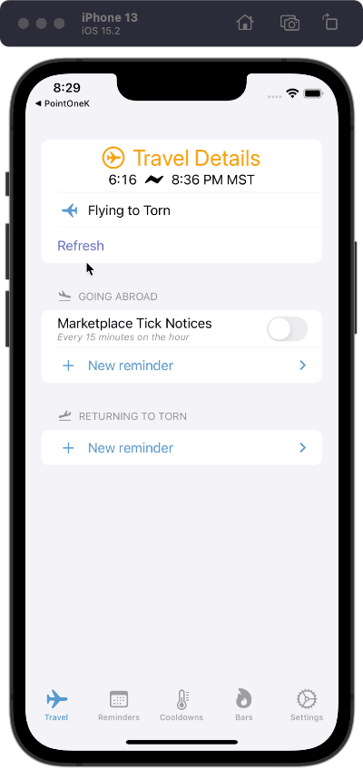
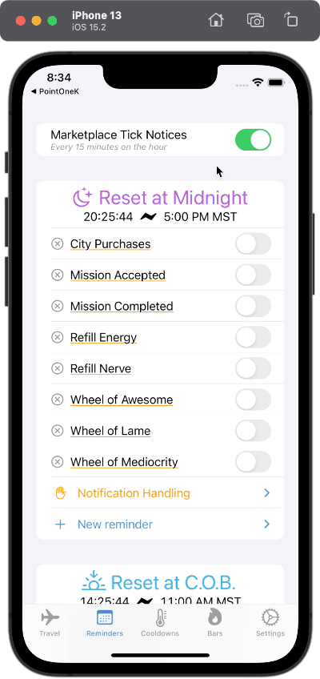
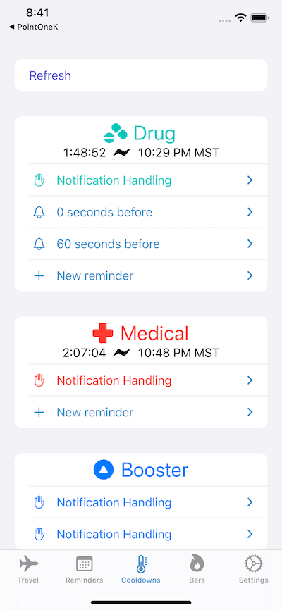
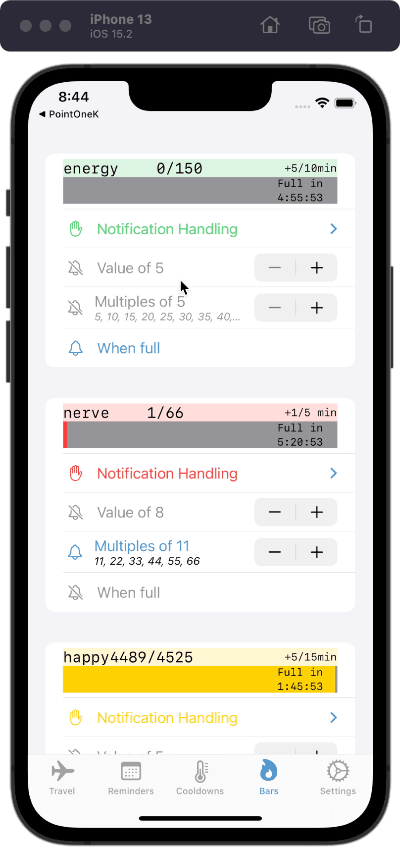
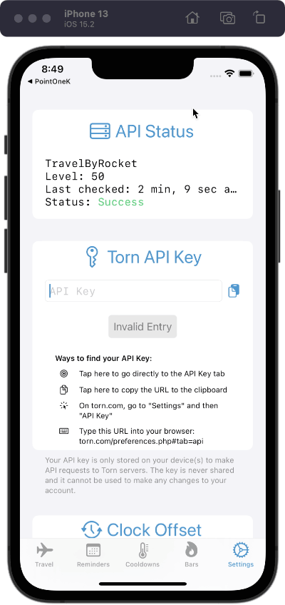
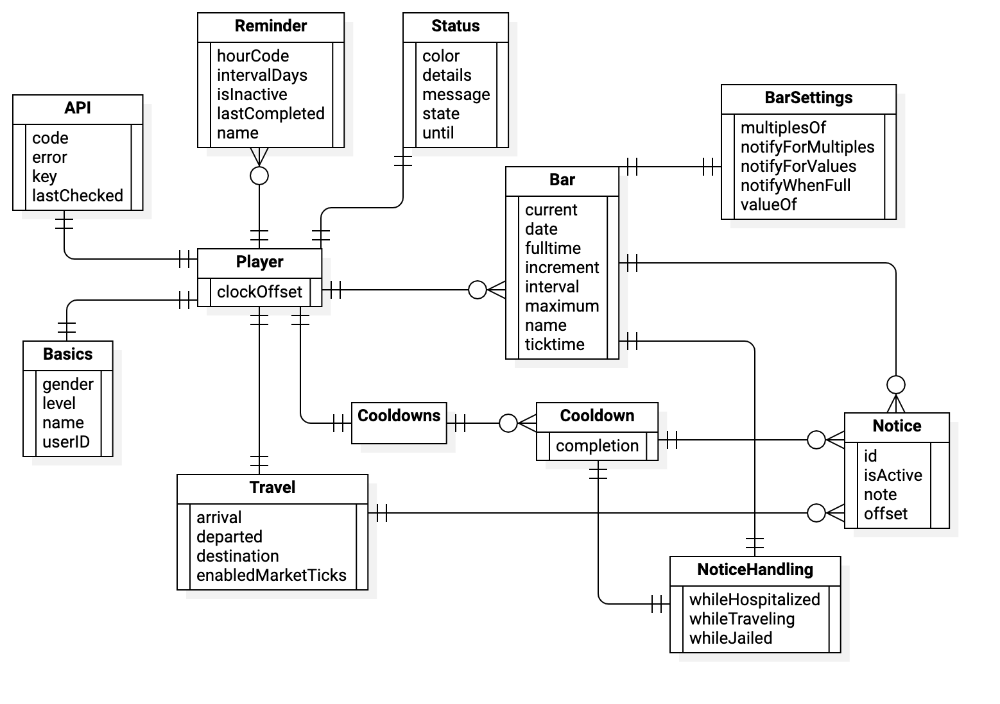

# Torn Assistant

The "Torn Ass't" is an app to track and manage notifications related to the online crime game [Torn](https://www.torn.com/2544362). There are some other tools in this space, and some of them are quite extensive, but I want my approach to stand out by focusing on notification management and being iOS native.

As of February 2022 this app is still very much a work in progress but it is also already a substantial body of work to show my capacity for iOS development with an eye toward product management.

## User Interface

### Travel

The player can travel to several destinations around the world to purchase items and later sell them for a profit. Players can also be mugged and hospitalized abroad so it is best to minimized their time there, and everyone wants to make the best use of their time anyway. For these reasons, it can be helpful to get reminders at and before landing time.

#### Inbound and Outbound

Users can create their own set of reminders that are each an offset from the landing time. Landing abroad carries different risks and goals so there is one set of reminders for landing abroad and another for landing in Torn. 

#### Custom Symbols

There is an SF Symbol for an airplane landing but there is only one version and the airplane is traveling left-to-right. In the game (and in my own concept of traveling to/from Torn) the airplane travels left-to-right when going abroad and right-to-left when returning to Torn so I created a custom symbol to reflect this. The same was done for the simple airplane (planform) symbol. The new symbol names are `airplane.left` and `airplane.arrival.left`.

#### Time Display

The game operates on Torn Central Time (TCT), which is actually the same as GMT. When coordinating with others it is critical to make plans with respect to TCT because of the game's worldwide user base, but traveling in the game is strictly independent so for the landing I have chosen to only show the time left when that will occur in user's local time.

#### Marketplace Ticks

Items are occasionally out-of-stock and, even though you can never know exactly when it will re-stock, it will always be on a marketplace tick, which is every 15 minutes on the hour. There is an optional reminder toggle to get marketplace tick notifications until the player is traveling back to Torn. 

#### Quick Activate/Deactivate

Just like the user may have different needs coming to and going from Torn, their goals and attention for the game may change by the day or by the hour. To address this, the user can quickly activate/deactivate a reminder without completely deleting it. This change is marked by a bell with the accent color when active and a slashed bell with secondary color when inactive. 

#### Refresh

The **Refresh** button is currently only visible in `#if DEBUG` while pull to refresh is always available. I don't believe either option fully addresses the need to be clear and obvious, fast and easy, and indicative of how "stale" the data is or is not but a better solution eludes me so far.

### Reminders

There are quite a number of common tasks to be done in the game that are limited within a period of time, usually reset daily at a particular time. A player is often interested in tracking some of these tasks but rarely interested in all of them so they can be made inactive and collected at the bottom of the view. The tasks are grouped by when they reset in the game and then they can be toggled complete when done. The app will reset the toggles at the right time and on the right interval.

### Cooldowns

Players can use time-limited items in three different categories. Each item used will add a certain amount of time to the respective "cooldown" category timer and each category has a maximum time limit (that can also be changed through other mechanisms). Most users will try to maximize the benefit gained from each of these categories and this is done primarily by not wasting any time, i.e., never letting a timer run down to 0:00:00. The player might have different priorities at different points in the game, varying by season, day, or by in-game funds, and so the reminders here are highly configurable. 

### Bars

Game-play hinges largely around the four different bars that each player has. Energy and Nerve each allow different sets of tasks, while Happy affects gym gains (which uses Energy), and Life, well, is obvious. The reminders used here are fairly unique compared to others because many tasks or set of tasks will require a minimum amount in a bar and all values between would don't provide any extra benefit for attending to the game. Again, options in the app are to allow not just the best use of resources in the game, but also the best use of attention in real life by avoiding task switching and recall from memory. 

### Settings

The app is completely based off of the data received from the game's API so there is a central place to manage and monitor this connection. 

## Data Model

The attributes and relationships are documented fairly extensively in the code and this is a UML-like summary. There are some inconsistencies and improvements to make but this has worked so far as I continue to develop the many areas of the app. 

